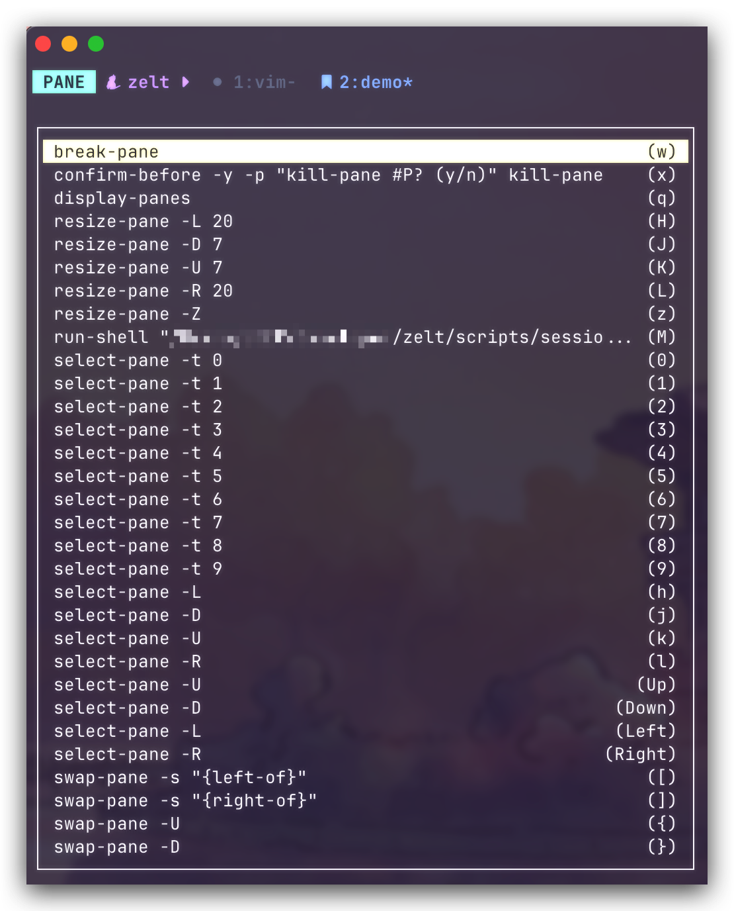
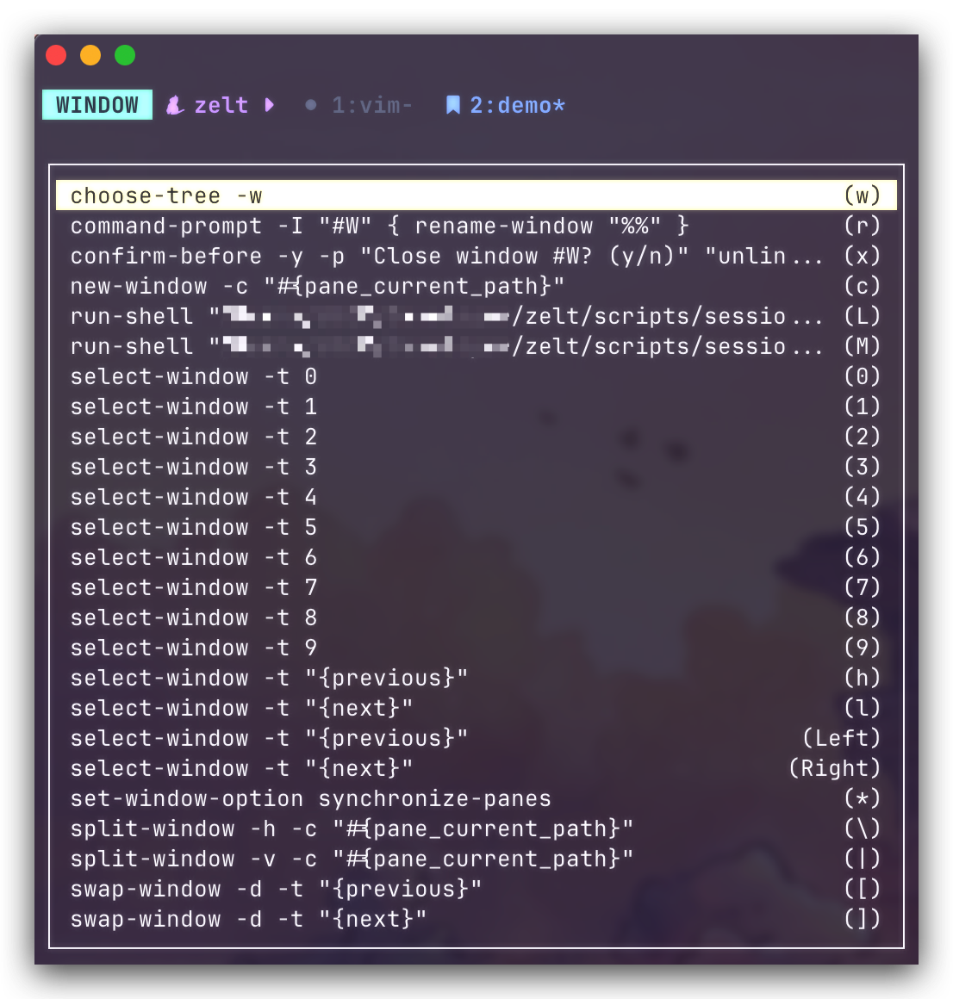
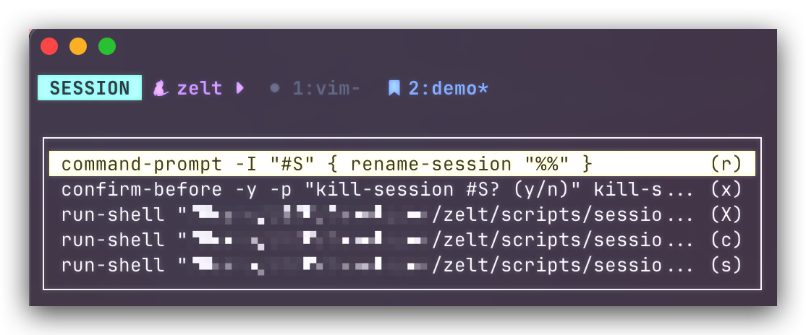
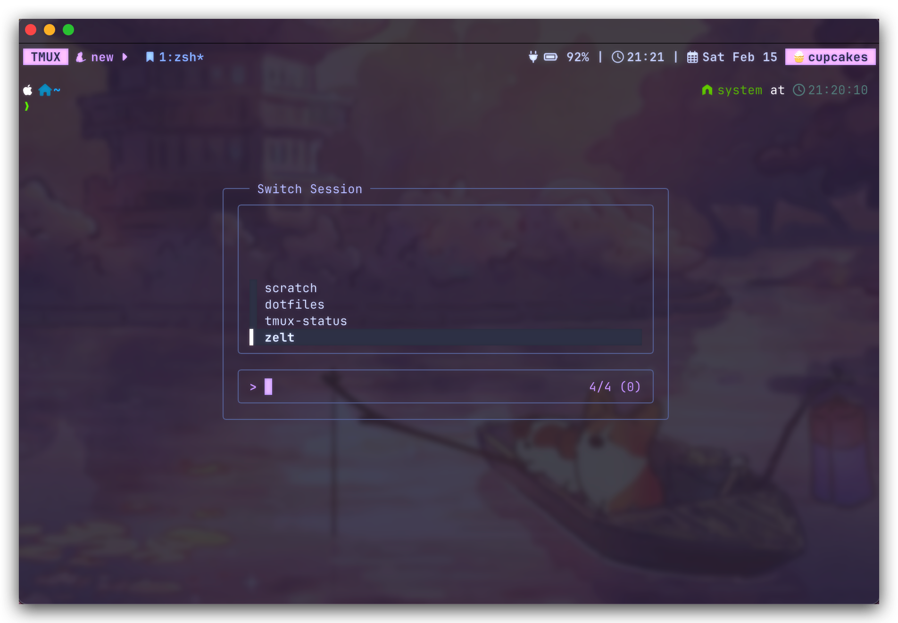
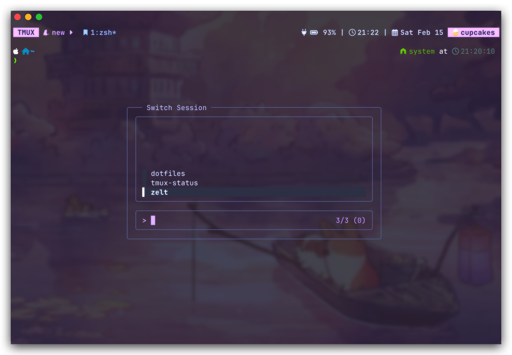

# ZeLT: Zellij-Like Tmux keybindings

A `tmux` plugin to create modal keybinds like `Zellij`.

**Pane Mode**


**Window Mode**


**Session Mode**


## Keybind Hint Menu

`ZeLT` also shows hint menus to help beginners familiarize themselves with the new keybinds faster:

**Pane Hint**



**Window Hint**



**Session Hint**



## Installation

### Installation with [Tmux Plugin Manager](https://github.com/tmux-plugins/tpm)

Add the following to your `tmux.conf` file:

```shellsession
$ set -g @plugin 'john0227/ZeLT'
```

### Manual Installation

Clone this repository and add the following to your `tmux.conf` file:

```shellsession
$ git clone https://github.com/john0227/ZeLT.git ~/.tmux/plugins/ZeLT
$ run-shell ~/.tmux/plugins/ZeLT/zelt.tmux
$ tmux source-file ~/.tmux.conf  # reload tmux.conf file
```

## Options

### Mode Prefix

```shell
set -g @zelt_prefix_pane    'C-p'
set -g @zelt_prefix_window  'C-w'
set -g @zelt_prefix_session 'C-s'
```

### Mode Hint Menu

```shell
# Enable hint menu for each mode
set -g @zelt_show_hint_pane    'on'
set -g @zelt_show_hint_window  'on'
set -g @zelt_show_hint_session 'on'

# Hint menu location
set -g @zelt_hint_menu_x '0'
set -g @zelt_hint_menu_y 'S'
```

For a list of possible values for `@zelt_hint_menu_x` and `@zelt_hint_menu_y`, check `display-menu` command entry under `man tmux` page.

### Sessions

`ZeLT` comes with a basic session manager that allows you to create, switch to, rename, and delete sessions.



You can set the `@zelt_filtered_sessions` option to a comma separated list of session names you want to filter from the preview:

```shell
# Default configuration
set -g @zelt_filtered_sessions ''

# Filters scratch
set -g @zelt_filtered_sessions 'scratch'

# Filters scratch and somesession
set -g @zelt_filtered_sessions 'scratch,somesession'
```

Because I use [`omerxx/tmux-floax`](https://github.com/omerxx/tmux-floax) plugin, I set `'scratch'`, which will show the following:



### Keybind Hook

By default, [`keybind_hook.sh`](./scripts/keybind_hook.sh), which collects currently bound modal keybinds, is set to run each time new session is created via:

```shell
tmux set-hook -ga session-created "run-shell /path/to/zelt/scripts/keybind_hook.sh"
```

You can also manually run the hook through the `@zelt_keybind_hook_key` key (default `[prefix] +`):

```shell
set -g @zelt_keybind_hook_key '+'
```

### Tmux Mode Indicator

If you use [tmux-mode-indicator](https://github.com/MunifTanjim/tmux-mode-indicator), you can configure `ZeLT` to show the additional pane, window, and session modes on the status bar:

```shell
set -g @zelt_enable_mode_indicator    'on'  # default 'off'
set -g @zelt_indicator_prefix_prompt  ' WAIT '
set -g @zelt_indicator_pane_prompt    ' PANE '
set -g @zelt_indicator_window_prompt  ' WINDOW '
set -g @zelt_indicator_session_prompt ' SESSION '
```

## Known Issues

- If hint menu is enabled, repeatable keybinds (set with `-r`) cannot be repeated

## Plugin Support

**[Tmux Mode Indicator](https://github.com/MunifTanjim/tmux-mode-indicator)**

The status bar shown at the top was configured with the `tmux-mode-indicator` plugin.

Add the following to your `tmux.conf` file:

```shellsession
$ # Add plugin
$ set -g @plugin 'MunifTanjim/tmux-mode-indicator'
$ # Set mode indicator option on
$ set -g @status_mode_indicator "on"
```

> [!NOTE]  
> Make sure `ZeLT` is loaded _before_ `tmux-mode-indicator`.
